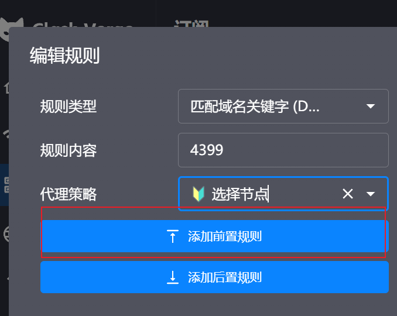

# 4399 注册接口逆向 —— 使用方法

对 `https://ptlogin.4399.com/ptlogin/register.do` 的加密链路做了完整还原：
脚本内输入**明文**，由脚本加密成服务端接受的密文再提交。

- 加密算法：AES-256-CBC + PKCS7，口令硬编码为 `lzYW5qaXVqa`
- 加密字段：`password` / `passwordveri` / `realname` / `idcard`
- 明文提交：`username` / `email` 及全部隐藏域

详细逆向过程与证据链见 [`artifacts/task-report.md`](artifacts/task-report.md)。

---

## 1. 环境要求

- Python 3.8+（开发环境为 3.14.5）
- 依赖见 `src/requirements.txt`

```bash
pip install -r src/requirements.txt
```

## 2. 文件结构

```
4399_rev/
├── README.md                    ← 本文件
├── artifacts/
│   └── task-report.md           ← 逆向过程、证据链、已知边界
├── raw/                         ← 逆向时抓取的原始文件（保留作证据）
│   ├── validation.js            ← 加密函数 encryptAES 所在
│   ├── cryptojs-aes.js          ← CryptoJS 库
│   ├── regFrame_reg_normal.html ← reg_normal 完整注册表单
│   └── ...
└── src/
    ├── requirements.txt
    ├── crypto_4399.py           ← 加解密实现（encrypt_aes / decrypt_aes）
    ├── register_4399.py         ← 注册客户端（命令行 + 可当库用）
    └── verify_js.js             ← 与站点真实 CryptoJS 的交叉验证脚本
```

> `src/` 里有 `from crypto_4399 import encrypt_aes` 这样的同目录导入，
> **命令需要在 `src/` 目录下执行**，或者把 `src/` 加进 `PYTHONPATH`。

## 3. 快速开始

注意：默认使用Clash代理127.0.0.1:7897，需要为4399域名添加白名单指向节点。

Clash Verge->订阅->右键->编辑规则->匹配域名关键字 (DOMAIN-KEYWORD)->规则内容输入4399->代理策略选择一个节点(不要使用DIRECT)->添加前置规则->保存即可。



不使用代理会导致弹出图形验证码。

### 3.1 批量生成

注意：默认使用Clash代理127.0.0.1:7897，需要为4399域名添加白名单指向节点。

Clash Verge->订阅->右键->编辑规则->匹配域名关键字 (DOMAIN-KEYWORD)->规则内容输入4399->代理策略选择一个节点(不要使用DIRECT)->添加前置规则->保存即可。

不使用代理会导致弹出图形验证码。

```bash
python batch.py
```


### 3.2 手动提交

去掉 `--dry-run` 即可：

```bash
python register_4399.py \
    --username mytestacct001 \
    --password MyPass123 \
    --realname 张三 \
    --idcard 110101190001010014
```

返回结果示例：

```json
{"ok": false, "message": "您的身份证异常或错误", "status_code": 200}
```

## 4. 命令行参数

| 参数 | 必填 | 说明 |
|---|---|---|
| `--username` | 是 | 用户名，3-20 位，只允许字母/数字/`@`/`_` |
| `--password` | 是 | 密码，6-20 字符 |
| `--password2` | 否 | 确认密码，默认与 `--password` 相同 |
| `--realname` | 否 | 真实姓名（防沉迷实名用，服务端会核验） |
| `--idcard` | 否 | 身份证号（防沉迷实名用，服务端会核验） |
| `--email` | 否 | 选填，QQ 邮箱，用于找回密码；**不加密** |
| `--dry-run` | 否 | 只打印密文载荷，不发注册请求 |

## 5. 当库用

```python
import sys
sys.path.insert(0, "src")          # 或在 src/ 下运行

from register_4399 import Register4399

c = Register4399()
c.fetch_reg_frame()                # 拿隐藏域 + USESSIONID（必须）

result = c.register(
    username="mytestacct001",
    password="MyPass123",
    realname="张三",
    idcard="110101190001010014",
)
print(result)
# {'ok': False, 'message': '您的身份证异常或错误', 'status_code': 200}
```

想分开控制流程时：

```python
c = Register4399()
info    = c.fetch_reg_frame()      # info['sec'] / info['suggested_username']
payload = c.build_payload(username="mytestacct001", password="MyPass123",
                          realname="张三", idcard="110101190001010014")
print(payload["password"])         # 密文
resp    = c.submit(payload)        # 原始 requests.Response
print(Register4399.parse_result(resp))
```

## 6. 只用加密函数

```python
import sys; sys.path.insert(0, "src")
from crypto_4399 import encrypt_aes, decrypt_aes

ct = encrypt_aes("MyPass123")
# 'U2FsdGVkX19IwnV8Lv/GR9eix60i6H24ESKQ2I5bk+8='

decrypt_aes(ct)
# 'MyPass123'   ← 解密仅用于抓包比对/自校验，注册流程用不到
```

命令行自测（会用站点真实 CryptoJS 产出的密文做交叉验证）：

```bash
python crypto_4399.py
# [OK ] JS密文 -> Python解密: '123456' == '123456'
# ...
# ALL PASS
```

## 7. 代理设置

> **注意**：`src/register_4399.py` 的 `Register4399.__init__` 里**硬编码了一个本地代理**：
>
> ```python
> self.session.proxies = {
>     "http":  "http://127.0.0.1:7897",
>     "https": "http://127.0.0.1:7897",
> }
> ```
>
> 端口 `7897` 是 Clash/Mihomo 的默认混合端口。**如果你本机没有跑这个代理，
> 请求会直接报 `ProxyError` / `ConnectionRefusedError`**，删掉这两行即可直连
> （实测直连 `ptlogin.4399.com` 是通的）。

要改成可选，可以这样：

```python
def __init__(self, headers=None, timeout=20, proxy=None):
    ...
    if proxy:
        self.session.proxies = {"http": proxy, "https": proxy}
```

## 8. 服务端响应速查

接口返回 **HTTP 200 + HTML**，错误信息在两个模板里，客户端已一并解析：

| 响应片段 | `parse_result` 结果 | 含义 |
|---|---|---|
| `<div class="login_error"><strong>wrong idcard</strong>` | `{"ok": false, "message": "wrong idcard"}` | 身份证格式不对（**在密码校验之前短路**） |
| `<div id="Msg">用户名格式错误</div>` | `{"ok": false, "message": "用户名格式错误"}` | 用户名不合法 |
| `<div id="Msg">您的身份证异常或错误</div>` | `{"ok": false, "message": "您的身份证异常或错误"}` | 格式过了，但实名库核验不通过 |
| 含 `login_comfirm` / `reg_success` | `{"ok": true, ...}` | 注册成功 |

## 9. 常见问题

**`ModuleNotFoundError: No module named 'crypto_4399'`**
没在 `src/` 目录下执行。`cd src` 或把 `src/` 加进 `PYTHONPATH`。

**`ProxyError` / `ConnectionRefusedError: [WinError 10061]`**
第 7 节的硬编码代理，删掉或改成自己的端口。

**每次密文都不一样，是对的吗？**
对。salt 每次随机，服务端自己解，不用管。

**`ModuleNotFoundError: No module named 'Crypto.Cipher._mode_cbc'` 之类**
环境里装过老的 `pycrypto`，先 `pip uninstall pycrypto` 再重装 `pycryptodome`。

**注册一直停在"身份证异常或错误"**
这是服务端在调用实名核验库，需要**真实姓名 + 对应身份证号**才能过。
前端没有任何逻辑绕过这一步，脚本也不做绕过。

## 10. 逆向结论速查

```js
// validation.js —— 全文唯一的加解密入口
function encryptAES(IdVal) {
    return CryptoJS.AES.encrypt(IdVal, 'lzYW5qaXVqa').toString();
}
```

`CryptoJS.AES.encrypt(明文, 字符串口令)` 走 PasswordBasedCipher 分支，等价于
OpenSSL `enc -aes-256-cbc -md md5 -pass pass:lzYW5qaXVqa` 的默认行为：

1. 随机生成 8 字节 salt
2. `EVP_BytesToKey(MD5, iterations=1)` 派生 32 字节 key + 16 字节 iv
3. AES-256-CBC + PKCS7
4. 输出 `Base64("Salted__" + salt + ciphertext)`

两个容易踩的点：

- **`regMode` 必须是 `reg_normal`**。用 `regMode=0` 请求拿到的是残缺表单，
  用户名 input 连 `name` 属性都没有，根本提交不上去。
- **`USESSIONID` cookie 是必需的**，由 `regFrame.do` 下发，`register.do` 依赖它。

同一套 `encryptAES` 也用于登录接口（`check_login` / `check_phone_login`），
要逆向登录可直接复用 `crypto_4399.py`。

---

## 免责声明

仅供安全研究与技术学习使用。这套加密是**固定密钥对称加密**，口令公开在前端，
属于传输层混淆而非安全防护。请勿用于批量注册、撞库或其他违反目标站点
服务条款的行为；由此产生的一切后果由使用者自行承担。
